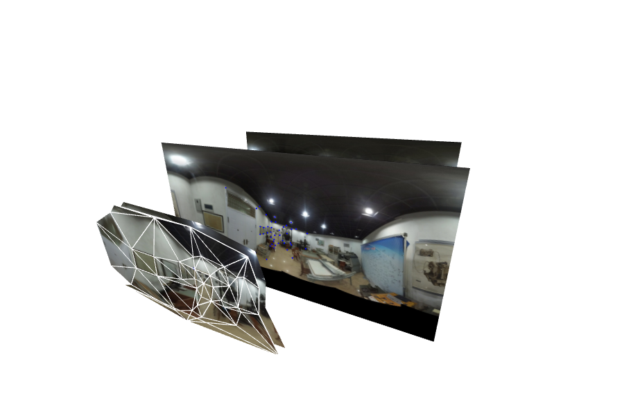
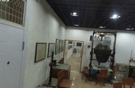

# [texture-morpher](index.html)
a tool to make morphable texture

通过三角化形成动态纹理，使得全景漫游系统的场景过渡更自然。

| Blend 方法 | Morph 方法 |
| :---: | :---: |
|  |  |

压力测试 & 示例：

-   [动态全景图](dyna_texture.html)
-   [动态全景球](dyna_sphere.html)

## 主界面 // Main window

查看 Demo：

-   先在【Editor】栏，点击【打开控件】，然后【加载示例 Pairs】
-   到【Sphere】栏，点击【打开控件】，然后【过渡】，效果不好（见上图 Blend 方法）；
-   再到【Editor】栏，点击【打控件】，然后【三角化】；
-   到【Sphere】栏，点击【打开控件】，最后【过渡】，效果好多了（见上图 Morph 方法）。

## 编辑器地使用 // Usage of Editor

-   在纹理上鼠标右键添加同名点；
-   新添加地同名点为激活状态，可以通过【方向键】 (蓝色点) 或【Control + 方向键】 (绿色点) 移动位置；
-   在右侧地 Pair List（同名点列表）也可以对位置进行微调；
-   可以通过 Pair List 上的【X】按钮删除一对同名点；
-   通过数字键【3】、【4】保存位置，然后通过数字键【1】、【2】加载位置，这样可以使得在前后两张图之间切换起来更容易；

## 纹理 1 & 纹理 2 // T1 & T2

-   通过【打开控件】下的【加载图片】加载新的全景图；

## 动态全景图 // Sphere

## 动态全景球 // SPHERE

---

Inspiration:

-   [Face Morphing using OpenCV (C++ / Python) - YouTube](https://www.youtube.com/watch?v=pqpS6BN0_7k)
-   [Face Morph Using OpenCV — C++ / Python | Learn OpenCV](http://www.learnopencv.com/face-morph-using-opencv-cpp-python/)

Notes:

-   [three.js / examples](https://threejs.org/examples/?q=texture#webgl_raycast_texture)
-   [three.js/webgl_raycast_texture.html at master · mrdoob/three.js](https://github.com/mrdoob/three.js/blob/master/examples/webgl_raycast_texture.html)
-   [pnitsch/GSVPano.js: Google Street View Panorama Util](https://github.com/pnitsch/GSVPano.js)
-   [Canvas Voronoi - bl.ocks.org](https://bl.ocks.org/mbostock/6675193)
-   [CodeSeven/toastr: Simple javascript toast notifications](https://github.com/CodeSeven/toastr)
-   [d3/API.md at master · d3/d3](https://github.com/d3/d3/blob/master/API.md#voronoi-diagrams-d3-voronoi)
-   [d3-voronoi/Diagram.js at master · d3/d3-voronoi](https://github.com/d3/d3-voronoi/blob/master/src/Diagram.js#L82).
-   [eligrey/FileSaver.js: An HTML5 saveAs() FileSaver implementation](https://github.com/eligrey/FileSaver.js)
